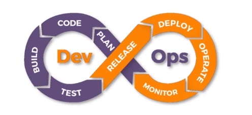

# DevOps

## Table of Contents

- [DevOps](#devops)
  - [Table of Contents](#table-of-contents)
    - [Introduction and Overview](#introduction-and-overview)
    - [Why DevOps](#why-devops)
    - [How DevOps Works](#how-devops-works)
    - [DevOps Tools](#devops-tools)
    - [Git](#git)
      - [Introduction to Git](#introduction-to-git)

### Introduction and Overview

- **Git**
- **Docker**
  - What Is Docker Swarm
  - Configuration And Management
    - Puppet, Ansible
- **Software Testing**
  - Selenium
- Continuous Integration(**CI**)
  - Jenkins
- **Kubernetes**
- **Continuos Monitoring**
  - Nagios

### Why DevOps

### How DevOps Works

So, by definition,

> **DevOps** is a software **methodology** which improves the **collaboration** between `developers and operations team` using various **tools**. These `automation tools` are implemented using various stages which are a part of the **DevOps Lifecycle**.

> **Plan** --> **Code** --> **Build** --> **Test** --> **Release(IR, ER)** --> **Deploy(server)** --> **Operate** --> **Monitor(log)**.

> There is no `perfect release`.

- **Continuous Development**:

> This stage involves committing code to version control system tools such as **Git** or **SVN** for maintaining the different versions fo the code, and tools like **Ant**, **Maven**, **Gradle** for `building/packaging` the code into an executable file that can be forwarded to the QAs for Testing.

- **Continuous Integration**:

> This stage is a `critical point` in the whole **Devops** lifecycle. It deals with integrating the different stages of the devops lifecycle, and is therefore the key in automating the whole devops process.

- **Continuous Deployment**:

> In this stage the code is **built**, the **environment** or the **application** is **containerized** and is `pushed` on to the desired **server**. The key processes in this stage are **configuration management**, **virtualization** and **containerization**.

- **Continuous Testing**:

> The stage deals with automated **testing** of the application pushed by the developer. If there is an **error**, the message is `sent back to the integration tool`, this tool in turn notifies the developer of the error. If the test was a success, the message is sent to integration tool which pushes the build on the production server.

- **Continuous Monitoring**:

> This stage continuously monitors the deployed application for **bugs** or **crashes**. It can also be setup to collect **users** feedback. The collected data is then sent to the developers to **improve** the application.

### DevOps Tools

- **Continuous Development**:

- **Continuous Integration**:

- **Continuous Deployment**:

- **Continuous Testing**:

- **Continuous Monitoring**:

**Final Overview**:

 
### Git

#### Introduction to Git