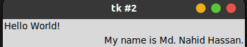
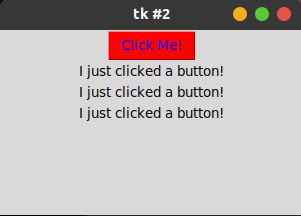
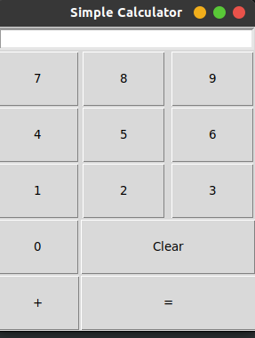

# Tkinter

Tkinter is build in Python.

[Youtube Link](https://youtu.be/yQSEXcf6s2I?list=PLCC34OHNcOtoC6GglhF3ncJ5rLwQrLGnV)

## Table of Contents

- [Tkinter](#tkinter)
  - [Table of Contents](#table-of-contents)
    - [1. First GUI Program](#1-first-gui-program)
    - [2) Grid System](#2-grid-system)
    - [3) Button](#3-button)
    - [Entry or Input Field](#entry-or-input-field)
    - [Building a Simple Calculator Part - 1](#building-a-simple-calculator-part---1)

### 1. First GUI Program

In `tkinter` everything is `widgets`. There is 

- Button widgets
- Text widgets
- Frame widgets

**Create root widget**:

- First thing we need to import `tkinter` module and create a `root` widgets, the `main window` widgets.

```py
from tkinter import tk

# 
root = Tk()
```

**Two step process**:

**1) Create widgets**

- Then simply create a `label` widgets.

```py
my_label = Label(root, text='Hello World!')
```

**2) Pack or fit widget on the window**:


```py
my_label.pack()
```

**Mainloop**:

```py
root.mainloop()
```

All code in one place:

```py
from tkinter import *

root = Tk()

# create a label widget
my_label = Label(root, text='Hello World!')
# showing it onto the screen
my_label.pack()

root.mainloop()
```

**Run program**:

```console
$ python3 hello.py
```

**Output**:


### 2) Grid System

```py
# create a label widgets
my_label1 = Label(root, text='Hello World!')
my_label2 = Label(root, text='My name is Md. Nahid Hassan.')
my_label3 = Label(root, text='              ')

# griding
# griding system are relative, that means row=0, column=5 don't make 
# a gap between row=0, column=0, this is just relative.

my_label1.grid(row=0, column=0)
my_label2.grid(row=1, column=5)
my_label3.grid(row=0, column=2)
```



**Hence Python is object oriented we can do this above things like this**:

```py
# Hence python is object oriented....we can do this things like this.
my_label1 = Label(root, text='Hello World!').grid(row=0, column=0)
my_label2 = Label(root, text='My name is Md. Nahid Hassan.').grid(row=0, column=1)
```

### 3) Button

- **Create simple Button**

```py
my_button = Button(root, text="Click Me!")
```

- **Button with `state` parameter**:

```py
my_button = Button(root, text="Click Me!", state=DISABLED)
```

- **Resizing button using `padx` and `pady`**

```py
my_button = Button(root, text="Click Me!", padx=50, pady=30)
```

- **Action Perform**:

```py
def my_click():
    my_label = Label(root, text='I just clicked a button!')
    my_label.pack()

# create button
my_button = Button(root, text="Click Me!", command=my_click)
```

- **`Foreground` and `Background` Color**:


```py
# also can taken hex code
my_button = Button(root, text="Click Me!", command=my_click, fg='blue', bg='red')
```

- **Final Code**:

```py
from tkinter import *

# create root widget
root = Tk()

def my_click():
    my_label = Label(root, text='I just clicked a button!')
    my_label.pack()

# create button
my_button = Button(root, text="Click Me!", command=my_click, fg='blue', bg='red')

# pack
my_button.pack()

# mainloop
root.mainloop()
```



### Entry or Input Field

- **Basic Entry**:

```py
entry = Entry(root, width=50, fg='blue', bg='gray')
entry.pack()
```

- **entry.get() and insert(position, text)**:

```py
# .....

# business logic
entry = Entry(root, width=50, borderwidth=3)
entry.pack()

entry.insert(0, "Enter your name ")

def click_me():
    #  .....
    # get() method
    hello = 'Hello ' + entry.get()
    label = Label(root, text=hello)
    # ....

button = Button(root, text='Submit', command=click_me)
#  ....
```

- **Full Code**:

```py
from tkinter import *

# start
root = Tk()

# business logic
entry = Entry(root, width=50, borderwidth=3)
entry.pack()
entry.insert(0, "Enter your name ")

def click_me():
    # entry.get()
    hello = 'Hello ' + entry.get()
    label = Label(root, text=hello)
    label.pack()

button = Button(root, text='Submit', command=click_me)
button.pack()

# end
root.mainloop()
```


### Building a Simple Calculator Part - 1

```py
from tkinter import *

root = Tk()

# set title
root.title("Simple Calculator")

# create an entry
entry = Entry(root, width=35, borderwidth=3)
entry.grid(row=0, column=0, columnspan=3)

# button add function
def button_click(number):
    entry.delete(0, END)
    entry.insert(0, number)

# Define buttons
button_1 = Button(root, text="1", padx=40, pady=20, command=lambda: button_click(1)).grid(row=3, column=0)
button_2 = Button(root, text="2", padx=40, pady=20, command=lambda: button_click(2)).grid(row=3, column=1)
button_3 = Button(root, text="3", padx=40, pady=20, command=lambda: button_click(3)).grid(row=3, column=2)
button_4 = Button(root, text="4", padx=40, pady=20, command=lambda: button_click(4)).grid(row=2, column=0)
button_5 = Button(root, text="5", padx=40, pady=20, command=lambda: button_click(5)).grid(row=2, column=1)
button_6 = Button(root, text="6", padx=40, pady=20, command=lambda: button_click(6)).grid(row=2, column=2)
button_7 = Button(root, text="7", padx=40, pady=20, command=lambda: button_click(7)).grid(row=1, column=0)
button_8 = Button(root, text="8", padx=40, pady=20, command=lambda: button_click(8)).grid(row=1, column=1)
button_9 = Button(root, text="9", padx=40, pady=20, command=lambda: button_click(9)).grid(row=1, column=2)

button_0 = Button(root, text="0", padx=40, pady=20, command=lambda: button_click(0)).grid(row=4, column=0)
button_clear = Button(root, text="Clear", padx=79, pady=20, command=button_click).grid(row=4, column=1, columnspan=2)

button_add = Button(root, text="+", padx=39, pady=20, command=button_click).grid(row=5, column=0)
button_equal = Button(root, text="=", padx=91, pady=20, command=button_click).grid(row=5, column=1, columnspan=2)

root.mainloop()
```

